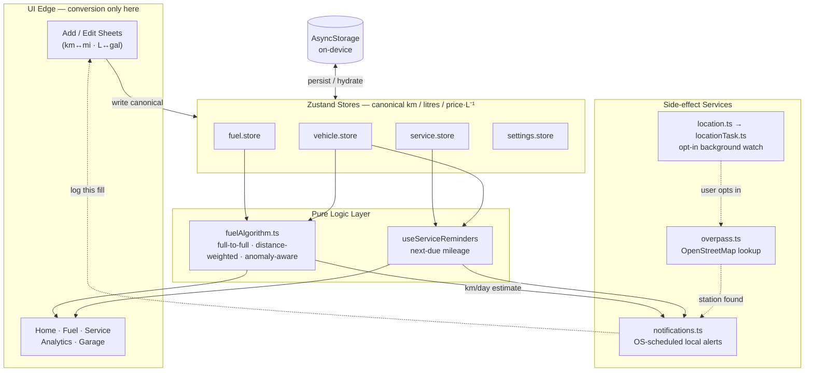

<div align="center">

<br/>

<!-- App Icon -->


<br/><br/>

# **FUELIO**

### Drive Smarter · Spend Less · Maintain Better

<br/>

> A privacy-first **fuel tracker, mileage calculator and car maintenance log** for React Native & Expo.
> Track fuel fills, calculate real-world fuel economy with the industry-standard full-to-full method, and never miss a service reminder — your data lives on your device.

<br/>

[](https://expo.dev)
[](https://reactnative.dev)
[](https://react.dev)
[](https://typescriptlang.org)

[](https://reactnative.dev/architecture/landing-page)
[](https://react.dev/learn/react-compiler)
[](#-privacy)
[](#-privacy)
[](#-privacy)
[](#-license)
[](#-contributing)

[](https://github.com/aashir-athar/fuelio/stargazers)
[](https://github.com/aashir-athar/fuelio/commits)
[](https://github.com/aashir-athar/fuelio)
[](https://github.com/aashir-athar/fuelio)

<br/>

[**Features**](#-features) · [**The Algorithm**](#-the-fuel-algorithm) · [**Tech Stack**](#-tech-stack) · [**Architecture**](#-architecture) · [**Getting Started**](#-getting-started) · [**Build & Ship**](#-building-an-apk-with-eas) · [**FAQ**](#-faq) · [**Contributing**](#-contributing)

</div>

---

<br/>

## 🆕 What's New in v2.0

Fuelio v2 is a ground-up upgrade across the algorithm, the runtime, and the experience.

| Area | v1 | v2.0 |
|:---|:---|:---|
| **Runtime** | Expo SDK 54 · RN 0.81 · React 18 | **Expo SDK 56 · RN 0.85.3 · React 19.2** |
| **Language** | TypeScript 5.9 | **TypeScript 6** |
| **Animation** | Reanimated 4.1 | **Reanimated 4.3 + Worklets** |
| **Build** | New Architecture | **New Architecture · React Compiler · typed routes** |
| **Fuel math** | full-tank window (v2 algorithm) | **Algorithm v3** — distance-weighted, odometer-sorted, anomaly-aware, EV-safe (13-case test harness) |
| **Storage** | mixed units | **Canonical units** — km, litres, price/litre stored; converted only at the UI edge |
| **Reminders** | in-app cards | **OS-scheduled local notifications** that fire even when the app is killed |
| **Logging** | manual only | **Optional station detection** — offer to log a fill when you stop at a pump |
| **Launch** | static splash | **Lottie animated splash** with a safe handoff |
| **Lists & loading** | spinners | **FlashList history + skeleton loaders + reduce-motion support** |

<br/>

---

<br/>

## ✨ Features

<br/>

<table>
<tr>
<td width="50%" valign="top">

### 🚗 &nbsp;Vehicle Management
Add unlimited vehicles with make, model, year, fuel type, tank capacity, and license plate. Edit or delete any vehicle and the change cascades to all linked records. Set an **active vehicle** and the whole app follows it. Supports **5 fuel types**: Petrol · Diesel · Hybrid · CNG · EV.

<br/>

### ⛽ &nbsp;Fuel Tracking
Log volume, price, odometer, full vs partial tank, and optional notes. The odometer auto-updates when a newer entry is higher. Edit or delete any past fill. Economy is computed with the **full-to-full window method** (the [algorithm](#-the-fuel-algorithm) the pros use), not naive litres-over-distance.

<br/>

### 🔧 &nbsp;Service History & Reminders
**9 service types**: Oil Change · Tire Rotation · Brakes · Battery · Air Filter · Timing Belt · Alignment · Coolant · Other. Oil-change entries capture SAE grade, oil type, and quantity. Next-due mileage is auto-calculated, and **local notifications fire even when the app is closed**.

</td>
<td width="50%" valign="top">

### 📊 &nbsp;Analytics
Average, best, and worst economy per vehicle. Total distance, fuel, cost, and cost-per-km. **Line chart** for economy over time, **bar chart** for monthly spend, and an automatic improving / stable / declining trend. Time filters: Week · Month · Year · All time.

<br/>

### 📍 &nbsp;Station Detection &nbsp;<sup>(opt-in)</sup>
Off by default. When you turn it on, Fuelio watches for when you stop at a fuel station and offers a **"log this fill"** prompt. Tap it and the quick-log sheet opens, pre-framed so you can enter the numbers while they are fresh.

<br/>

### ⚙️ &nbsp;Units & Settings
- **Theme** — System / Light / Dark
- **Distance** — km or mi
- **Volume** — Litres or Gallons
- **Currency** — USD · EUR · GBP · PKR · AED · SAR · INR
- **Notifications** — service reminder alerts
- **One-tap data wipe** in Settings

</td>
</tr>
</table>

<br/>

---

<br/>

## 🧠 Architecture at a Glance

Data flows one way. Forms write **canonical units** (km, litres, price per litre) into the stores; the pure algorithm derives every number; screens convert to the user's units only at the very edge.



> **The only network calls** in the entire app come from the dotted path: the opt-in station watch querying OpenStreetMap. Everything else is local.

<br/>

---

<br/>

## ⚗️ The Fuel Algorithm

> `src/utils/fuelAlgorithm.ts` · validated by a 13-case Node test harness (`npm test`)

**Why naive math breaks.** Dividing litres by distance gives a wrong number the moment a partial fill is logged: a 20 L top-up followed by a 40 L fill produces two meaningless economy readings.

**Algorithm v3 — the full-to-full window method** is the same approach used by [Fuelly](https://www.fuelly.com) and [Spritmonitor](https://www.spritmonitor.de). Fuel economy can only be measured between two brim-full fills:

```
For each FULL fill that closes a window:
  windowFuel     = banked partials in the window + this closing fill
  windowDistance = thisOdometer − anchorOdometer (the previous full fill)
  economy(km/L)  = windowDistance / windowFuel
```

Partial fills never get their own economy number. Their fuel is **banked** and rolls into the next full-tank window, so it is counted exactly once.

### What makes v3 honest

| Principle | What it means |
|:---|:---|
| **Distance-weighted average** | Lifetime economy is `Σ window distance / Σ window fuel`, not a mean of per-window ratios. Short windows no longer over-weight the figure. |
| **Odometer-sorted** | Entries sort by odometer (date as tiebreak), so a legitimately back-dated fill is no longer misflagged as an odometer regression and silently dropped. |
| **Anomaly-aware** | Odometer regressions, duplicate readings, excessive distance, overfills, and physically implausible economy are **excluded** from every aggregate, not just flagged. |
| **EV-safe** | EVs short-circuit volumetric economy (km/L is meaningless for them); distance, cost, and service intervals still compute, CO₂ is zero. |

### Per-fill efficiency badge

Each measured window is scored against the **vehicle's own** history. With 4+ samples it uses a z-score so the bands adapt to that vehicle; with sparse data it falls back to contiguous percentage bands.

| Score | Label | Sparse-data threshold (vs personal average) |
|:---:|:---|:---|
| 🟢 | **Excellent** | ≥ 8% above |
| 🔵 | **Good** | 2 – 8% above |
| 🟡 | **Average** | within −5% … +2% |
| 🔴 | **Poor** | > 5% below |

<br/>

---

<br/>

## 🛠 Tech Stack

| Category | Library | Version |
|:---|:---|:---|
| **Framework** | [Expo](https://expo.dev) | `SDK 56` |
| **UI** | [React Native](https://reactnative.dev) | `0.85.3` |
| **Runtime** | [React](https://react.dev) | `19.2.3` |
| **Language** | [TypeScript](https://typescriptlang.org) | `~6.0.3` |
| **Router** | [Expo Router](https://docs.expo.dev/router/introduction/) (typed routes) | `~56.2.8` |
| **Animations** | [Reanimated](https://docs.swmansion.com/react-native-reanimated/) + [Worklets](https://docs.swmansion.com/react-native-worklets/) | `4.3.1` / `0.8.3` |
| **Gestures** | [Gesture Handler](https://docs.swmansion.com/react-native-gesture-handler/) | `~2.31.1` |
| **Lists** | [@shopify/flash-list](https://shopify.github.io/flash-list/) | `2.0.2` |
| **Splash** | [lottie-react-native](https://github.com/lottie-react-native/lottie-react-native) | `~7.3.4` |
| **Notifications** | [expo-notifications](https://docs.expo.dev/versions/latest/sdk/notifications/) | `~56.0.15` |
| **Location** | [expo-location](https://docs.expo.dev/versions/latest/sdk/location/) + [expo-task-manager](https://docs.expo.dev/versions/latest/sdk/task-manager/) | `~56.0.15` |
| **State** | [Zustand](https://zustand-demo.pmnd.rs) | `^5.0.12` |
| **Persistence** | [AsyncStorage](https://react-native-async-storage.github.io/async-storage/) | `2.2.0` |
| **Haptics** | [expo-haptics](https://docs.expo.dev/versions/latest/sdk/haptics/) | `~56.0.3` |
| **Architecture** | New Architecture · React Compiler | ✅ enabled |

<br/>

---

<br/>

## 🎨 Design System

### Brand Colors

| Token | Dark | Light | Usage |
|:---|:---:|:---:|:---|
| `accent` | `#B6F24D` | `#8DC827` | CTAs, charts, active states |
| `background` | `#0D1117` | `#F4F6FB` | Screen backgrounds |
| `surface` | `#161B27` | `#FFFFFF` | Cards, sheets |
| `surfaceElevated` | `#1E2433` | `#EEF1F8` | Inputs, raised elements |
| `danger` | `#FF4757` | `#E33B4A` | Delete actions, errors |
| `textPrimary` | `#F0F4FF` | `#0D1117` | Body copy |
| `textSecondary` | `#8A94A8` | `#4A5168` | Labels, captions |
| `gold` | `#F5C842` | `#E0A81F` | Upcoming service warnings |
| `secondary` | `#4DAFFF` | `#2E8FE0` | Line charts, secondary highlights |

### Spacing — 8-point Grid

```
space[1] =  4px    space[4] = 16px    space[7] = 32px
space[2] =  8px    space[5] = 20px    space[8] = 40px
space[3] = 12px    space[6] = 24px    space[10]= 64px
```

### Motion Presets

```ts
spring.snappy  // damping: 18, stiffness: 320  →  button press feedback
spring.smooth  // damping: 22, stiffness: 220  →  layout transitions
spring.soft    // damping: 14, stiffness: 120  →  playful entrances
```

All motion respects the system **Reduce Motion** setting through `useReduceMotion()` — the animated splash falls back to a static brand mark, and entrances become instant.

### Text Variants

`micro` · `caption` · `label` · `body` · `bodyLg` · `heading` · `title` · `display`

Tone props: `primary` · `secondary` · `muted` · `accent` · `onAccent` · `danger`

<br/>

---

<br/>

## 🏗 Architecture

### Canonical-unit storage

Everything persists in one unit system: **kilometres**, **litres**, and **price per litre**. Display units (km/mi, litres/gallons, currency) are applied only by the formatters at render time, and forms convert user input back to canonical units on save. This is what lets the same data set switch between metric and imperial correctly, with no drift.

### One-way data flow

Stores hold the canonical truth. The pure `fuelAlgorithm.ts` derives every economy, cost, distance, and trend number. Screens read derived values through memoised hooks (`useVehicleStats`, `useServiceReminders`) and never recompute math inline. See the [diagram above](#-architecture-at-a-glance).

### OS-scheduled notifications

`src/services/notifications.ts` schedules **local** notifications that the OS fires even when the app is fully killed — no server, no push token.

- **Service reminders are mileage-based**, so Fuelio estimates the calendar date the vehicle will reach the due odometer from its own km/day rate (`avgKmBetweenFills / avgDaysBetweenFills`) and schedules a dated trigger, nudging a few days early. Reminders are cancelled and rescheduled whenever the data changes, so edits never pile up duplicates.
- Android channels are created up front (8.0+ drops notifications without them).

### Opt-in station detection

Off by default and entirely user-controlled. When enabled (`src/services/location.ts`), a background task (`locationTask.ts`) receives location updates only after ~120 m of movement (battery friendly). On each batch it throttles, then asks the **OpenStreetMap Overpass** API whether a fuel station sits within ~70 m. If so, it fires the "Are you fueling up?" prompt at most once every 30 minutes. Tapping it opens the quick-log sheet. Turning the feature off stops the watch; the OS permission is never revoked behind your back.

### Animated splash with a safe handoff

`AnimatedSplash.tsx` plays a Lottie loop over the app **after** the native splash hides, then fades out and unmounts. The real app renders underneath the whole time, so if Lottie ever fails the worst case is a brief branded fade, never a broken screen. The background colour matches `app.json` exactly for a seamless handoff.

### Performance focus (low-end Android)

FlashList powers the fuel history, skeleton placeholders stand in for every loading state (no spinners), the New Architecture and React Compiler reduce bridge and re-render cost, and motion is gated on Reduce Motion. The target is smooth interaction on a 2 GB Android device.

<br/>

---

<br/>

## 📁 Project Structure

```
fuelio/
│
├── app/                              # Expo Router — file-based, typed routes
│   ├── _layout.tsx                   # Root: providers · nav guard · hydration gate · splash
│   ├── index.tsx                     # Entry redirect
│   ├── (onboarding)/                 # welcome · add-first-vehicle
│   ├── (tabs)/                       # home · fuel · service · analytics · garage
│   └── modal/                        # settings · export · add/edit vehicle · edit fuel
│
└── src/
    ├── components/
    │   ├── primitives/               # Button · Card · Chip · Input · Sheet · SegmentedControl …
    │   ├── cards/                    # FuelEntryRow · ServiceReminderCard · VehicleCard
    │   ├── charts/                   # BarChart (spend) · LineChart (economy)
    │   ├── sheets/                   # AddFuelSheet · AddServiceSheet · VehicleForm
    │   └── AnimatedSplash.tsx        # Lottie splash overlay (reduce-motion aware)
    │
    ├── store/                        # Zustand — canonical-unit stores + hydration gate
    │   ├── vehicle.store.ts          # vehicles + active vehicle
    │   ├── fuel.store.ts             # fuel entries
    │   ├── service.store.ts          # service entries
    │   ├── settings.store.ts         # theme · units · currency · feature flags
    │   ├── hydration.ts             # multi-store hydration gate
    │   └── storage.ts                # AsyncStorage ↔ Zustand adapter
    │
    ├── hooks/                        # useActiveVehicle · useVehicleStats · useServiceReminders
    │                                 # useHaptics · useReduceMotion
    │
    ├── services/
    │   ├── notifications.ts          # OS-scheduled local reminders + fuel-up prompt
    │   ├── location.ts               # opt-in start/stop/resume of the station watch
    │   ├── locationTask.ts           # background TaskManager geofence-ish task
    │   └── overpass.ts               # OpenStreetMap fuel-station lookup (no key)
    │
    ├── theme/                        # ThemeProvider · colors · tokens
    ├── types/                        # all domain types — single source of truth
    └── utils/
        ├── fuelAlgorithm.ts          # v3 full-to-full window economy + stats
        ├── format.ts                 # number · currency · distance · volume · date
        ├── serviceLabels.ts          # service-type labels + intervals
        ├── csv.ts                    # RFC-4180 CSV serialisers
        └── id.ts                     # prefixed ID generator
```

<br/>

---

<br/>

## 🗄 Data Model

> All numeric fields are stored in **canonical units**: km, litres, price per litre.

<details>
<summary><strong>Vehicle</strong></summary>

```ts
interface Vehicle {
  id: string;            // "veh_k2x9m"
  nickname: string;
  make: string;
  model: string;
  year: number;
  fuelType: 'petrol' | 'diesel' | 'hybrid' | 'cng' | 'ev';
  tankCapacity: number;  // litres
  odometer: number;      // km — auto-bumped on a higher fuel entry
  licensePlate?: string;
  vin?: string;
  photoUri?: string;
  color?: string;
  createdAt: number;     // Unix ms
}
```

</details>

<details>
<summary><strong>FuelEntry</strong></summary>

```ts
interface FuelEntry {
  id: string;             // "fuel_p8zq1"
  vehicleId: string;
  date: number;           // Unix ms
  liters: number;         // canonical litres
  pricePerLiter: number;  // canonical price per litre
  odometer: number;       // km
  fullTank: boolean;      // drives the full-to-full window method
  totalCost: number;      // liters × pricePerLiter
  distanceDriven?: number;// computed by the algorithm
  efficiency?: number;    // km/L — computed for window-closing fills only
  notes?: string;
  receiptUri?: string;
}
```

</details>

<details>
<summary><strong>ServiceEntry</strong></summary>

```ts
interface ServiceEntry {
  id: string;              // "svc_r3nq7"
  vehicleId: string;
  type: ServiceType;       // 9 types
  date: number;
  odometer: number;        // km
  cost: number;
  completed: boolean;
  oilGrade?: OilGrade;     // oil-change only (SAE grades)
  oilType?: OilType;       // 'fully-synthetic' | 'semi-synthetic' | 'mineral'
  oilQuantity?: number;    // litres
  nextDueMileage?: number; // km — auto: odometer + service interval
  nextDueDate?: number;
  notes?: string;
  photoUri?: string;
}
```

</details>

### Service Intervals

| Service | Interval | Service | Interval |
|:---|---:|:---|---:|
| Oil Change | 5,000 km | Coolant | 40,000 km |
| Tire Rotation | 10,000 km | Brakes | 40,000 km |
| Air Filter | 20,000 km | Battery | 60,000 km |
| Alignment | 20,000 km | Timing Belt | 100,000 km |

<br/>

---

<br/>

## 🚀 Getting Started

> Fuelio uses native modules (Lottie, location, notifications), so **Expo Go is limited**. Use a development build for the full experience. The complete walkthrough lives in **[`zero-to-deploy.md`](zero-to-deploy.md)**.

### Prerequisites

- **Node.js** 18 or newer
- **eas-cli** — `npm install -g eas-cli`
- An Android device or emulator (Android-first; iOS untested)

### Install & run a dev build

```bash
# Clone
git clone https://github.com/aashir-athar/fuelio.git
cd fuelio

# Install dependencies
npm install

# Option A: cloud dev build (no Android Studio needed)
eas build --profile development

# Option B: local run if you have the Android toolchain
npx expo run:android
```

Once a dev build is installed on your device, start the bundler with `npm start` and open the app.

### Quality gates

```bash
npm run typecheck    # tsc --noEmit (strict)
npm run lint         # expo lint
npm test             # node --test — the 13-case fuel-algorithm harness
npx expo-doctor      # dependency + config health check
```

<br/>

---

<br/>

## 📦 Building an APK with EAS

EAS Build runs on Expo's cloud — no Android Studio, no JDK, no local keystore.

```bash
# 1. Log in (free account at expo.dev)
eas login

# 2. Sideloadable APK — install directly on any Android device
eas build -p android --profile preview

# 3. Play Store bundle (AAB)
eas build -p android --profile production

# 4. Submit to the Play Store
eas submit -p android --latest
```

Notes:
- `app.json` already sets `version: "2.0.0"`, the package `com.iamaashirathar.fuelio`, and the notification + location plugins.
- `eas.json` uses `appVersionSource: "remote"`, so EAS owns the build/version numbers; the `production` profile auto-increments.
- Builds take roughly **10–15 minutes**; EAS prints a download URL and QR code when done.

For the full step-by-step path from a clean clone to a published build, see **[`zero-to-deploy.md`](zero-to-deploy.md)**.

<br/>

---

<br/>

## 🔒 Privacy

**Private by design. Your data lives on your device.** No accounts, no ads, no analytics SDKs, no crash reporters. Everything is stored locally in `AsyncStorage`, and a one-tap wipe in Settings clears it all.

**The only network calls happen if you opt in to station detection** — an anonymous lookup to the [OpenStreetMap Overpass](https://wiki.openstreetmap.org/wiki/Overpass_API) API to check whether you have stopped at a fuel station. No API key, no account, and only your approximate coordinates are sent for that single query. The feature is **off by default**, and you can turn it off anytime in Settings.

<br/>

---

<br/>

## ❓ FAQ

<details>
<summary><strong>Is Fuelio 100% offline?</strong></summary>

Almost. By default, nothing leaves your device. The single exception is the **optional, opt-in** station-detection feature, which makes an anonymous OpenStreetMap lookup when enabled. Leave it off and Fuelio makes zero network calls.
</details>

<details>
<summary><strong>How is fuel economy calculated?</strong></summary>

With the **full-to-full window method** ([details](#-the-fuel-algorithm)). Economy is only measured between two brim-full fills; partial fills bank their fuel into the next window. The lifetime average is distance-weighted, and anomalous windows are excluded.
</details>

<details>
<summary><strong>Why do partial fills not show their own km/L?</strong></summary>

Because there is no honest way to measure economy across a partial fill — the tank level is unknown. The fuel is banked and counted in the next full-tank window instead, so it is attributed exactly once.
</details>

<details>
<summary><strong>Do reminders work when the app is closed?</strong></summary>

Yes. Service reminders are scheduled as **local OS notifications**, so they fire even when the app is fully killed. Mileage-based reminders estimate a due date from your vehicle's own km/day rate.
</details>

<details>
<summary><strong>Does it work for electric vehicles?</strong></summary>

Yes. EVs skip volumetric economy (km/L is meaningless), but distance, cost, cost-per-km, service intervals, and reminders all work, and CO₂ is reported as zero.
</details>

<details>
<summary><strong>Can I switch between metric and imperial?</strong></summary>

Yes, freely. Data is stored in canonical units (km, litres) and converted only at display time, so switching km↔mi or litres↔gallons never corrupts your history.
</details>

<details>
<summary><strong>Why can't I just use Expo Go?</strong></summary>

Fuelio depends on native modules — Lottie, background location, and notifications — that Expo Go does not fully support. Use a development build (`eas build --profile development` or `npx expo run:android`).
</details>

<details>
<summary><strong>Does it run on iOS?</strong></summary>

The codebase targets both platforms, but Fuelio is developed and tested Android-first. iOS polish is an open contribution.
</details>

<br/>

---

<br/>

## 🤝 Contributing

Fuelio is open to contributions of every size — bug fixes, docs, translations, and features are all welcome.

### Ideas for contributors

| Idea | Difficulty | Notes |
|:---|:---:|:---|
| 🍎 **iOS polish** — test and refine the iOS experience | Medium | Currently Android-first |
| 📸 **Receipt photos** — attach a photo to any fuel entry | Easy | `expo-image-picker` already installed |
| 📤 **PDF export** — formatted service history as PDF | Medium | `expo-sharing` already available |
| 🗺️ **Station history** — remember detected stations and pre-fill them | Medium | Builds on `overpass.ts` |
| 🚘 **Multi-driver** — track who drove per fill | Medium | Add `driverId` to entries |
| 🎨 **Accent picker** — let users choose their accent color | Easy | Extend `ThemeProvider` |
| 🌙 **AMOLED theme** — pure-black background option | Easy | Add to `theme/colors.ts` |
| 📊 **CO₂ dashboard** — surface estimated emissions per vehicle | Easy | `estimatedCO2kg` already computed |
| 🌐 **More currencies** — extend the currency list | Easy | `src/store/settings.store.ts` |

### How to contribute

1. **Fork** the [repository](https://github.com/aashir-athar/fuelio)
2. **Branch** off `main` — `git checkout -b feature/my-feature`
3. **Follow the conventions:**
   - All colors via `useTheme()` — no hardcoded hex in components
   - All spacing via `space[n]` tokens — no hardcoded pixels
   - Store and compute in **canonical units**; convert only at the UI edge
   - New domain types go in `src/types/index.ts`
   - TypeScript strict mode is on — no `any`
4. **Pass the gates** — `npm run typecheck`, `npm run lint`, `npm test`, `npx expo-doctor`
5. **Open a PR** with a clear description of what changed and why

<br/>

---

<br/>

## 📄 License

MIT © [Aashir Athar](https://github.com/aashir-athar)

<br/>

<div align="center">

**Built by [Aashir Athar](https://github.com/aashir-athar)**

Made with ☕ · Offline-first · No Ads · No Accounts

<br/>

*If Fuelio saves you money at the pump, give it a ⭐*

</div>
